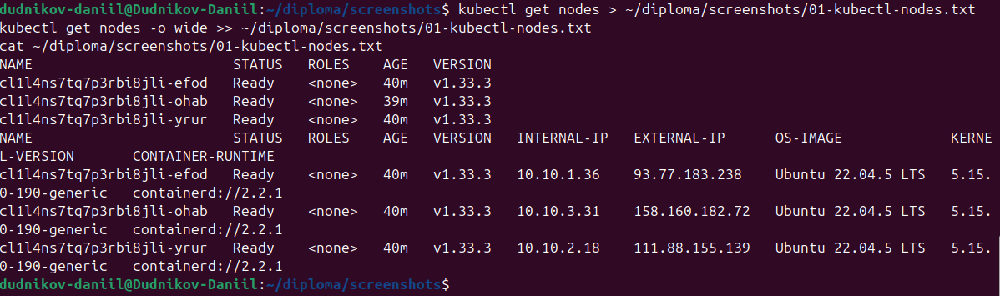
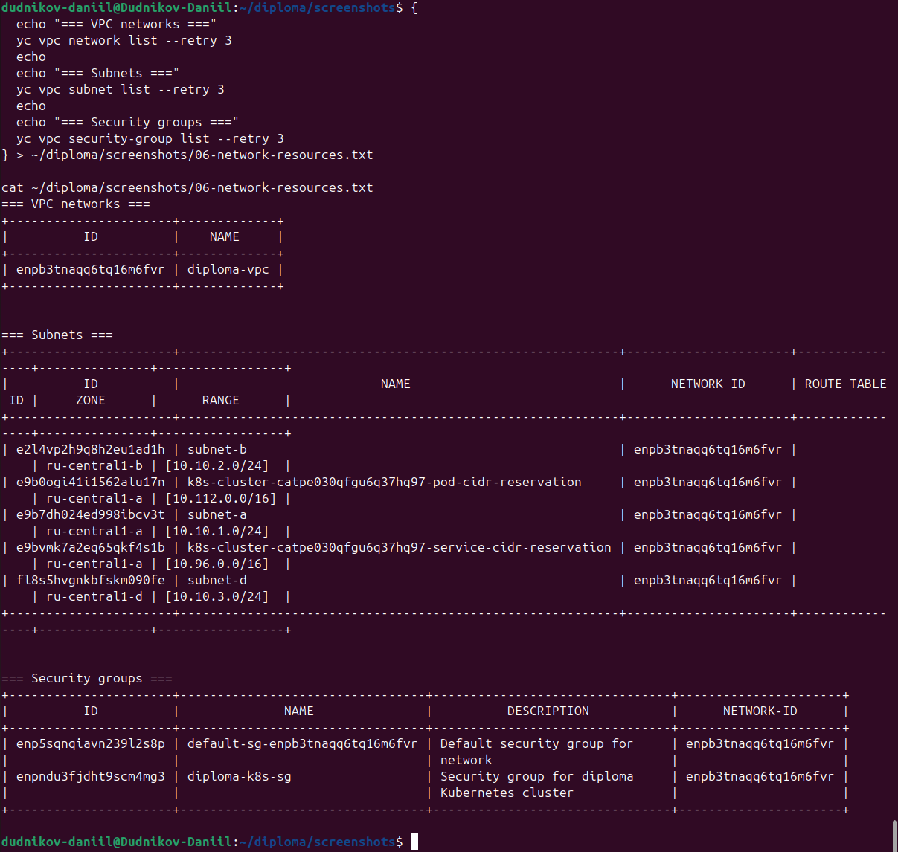

# Terraform Infrastructure

[](https://www.terraform.io/)
[](https://cloud.yandex.ru/)
[](https://kubernetes.io/)

Модуль Terraform для создания облачной инфраструктуры дипломного практикума в Yandex.Cloud: VPC, подсети, security group, Managed Kubernetes кластер и Node Group.

**Автор:** Дудников Даниил
**Группа:** FOPS-41
**Период работы:** 3 октября 2026 — 26 октября 2026

---

##  Что создаётся

| Ресурс | Описание |
|--------|----------|
| **VPC** | `diploma-vpc` |
| **Подсети** | 3 подсети в 3 зонах доступности |
| **Security Group** | `diploma-k8s-sg` |
| **Kubernetes** | Managed K8s `diploma-k8s` (v1.33, региональный мастер) |
| **Node Group** | `diploma-k8s-nodes` (3 ноды) |
| **Ресурсы нод** | `standard-v3`, 2 vCPU / 2 GB RAM, 30 GB HDD |

**Зоны доступности:**

- `ru-central1-a` — `subnet-a`, `10.10.1.0/24`
- `ru-central1-b` — `subnet-b`, `10.10.2.0/24`
- `ru-central1-d` — `subnet-d`, `10.10.3.0/24`

---

##  Скриншоты инфраструктуры

### Карта инфраструктуры


*VPC `diploma-vpc` связана с 3 подсетями и K8s кластером `diploma-k8s`.*

### Ноды Kubernetes



*`kubectl get nodes` — 3 worker-ноды в статусе Ready, по одной в каждой зоне.*

### Поды Kubernetes


*Системные поды в `kube-system` — кластер работает.*

### Кластер K8s


*Managed Kubernetes кластер `diploma-k8s` в статусе RUNNING.*

### Node Group


*Node Group `diploma-k8s-nodes` с 3 нодами.*

### ВМ в облаке


*3 виртуальные машины в статусе RUNNING.*

### VPC и подсети



*VPC, подсети, security groups.*

### Terraform state


*Список ресурсов в Terraform state.*

---

##  Структура репозитория

```
.
├── main.tf                   # Основная конфигурация
├── versions.tf               # Версии Terraform и провайдера
├── providers.tf              # Настройка провайдера Yandex
├── variables.tf              # Переменные
├── terraform.tfvars          # Значения переменных
├── network.tf                # VPC и подсети
├── security-groups.tf        # Security groups
├── k8s.tf                    # Managed Kubernetes
├── k8s-node-group.tf         # Node Group
├── container-registry.tf     # YC Container Registry
├── outputs.tf                # Outputs
├── docs/
│   └── screenshots/          # Скриншоты инфраструктуры
└── README.md                 # Этот файл
```

---

##  Backend

State хранится в S3-бакете, созданном в репозитории [terraform-bootstrap](https://github.com/DudnikovDaniil/terraform-bootstrap).

- **Bucket:** `diploma-tfstate-dudnikov-7efeef`
- **Key:** `infrastructure/terraform.tfstate`
- **Версионирование:** включено
- **Lifecycle:** удаление старых версий через 30 дней

---

##  Применение

```bash
terraform init
terraform plan
terraform apply
```

---

##  Ссылки

- [Основной проект diploma-app](https://github.com/DudnikovDaniil/diploma-app)
- [terraform-bootstrap](https://github.com/DudnikovDaniil/terraform-bootstrap)

---

##  Лицензия

Учебный проект. Свободное использование в образовательных целях.

© 2026, Дудников Даниил
